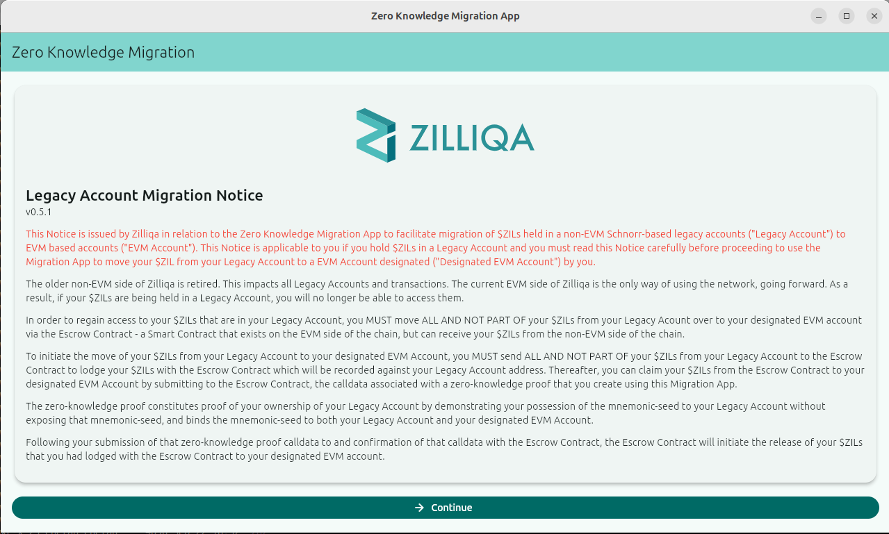
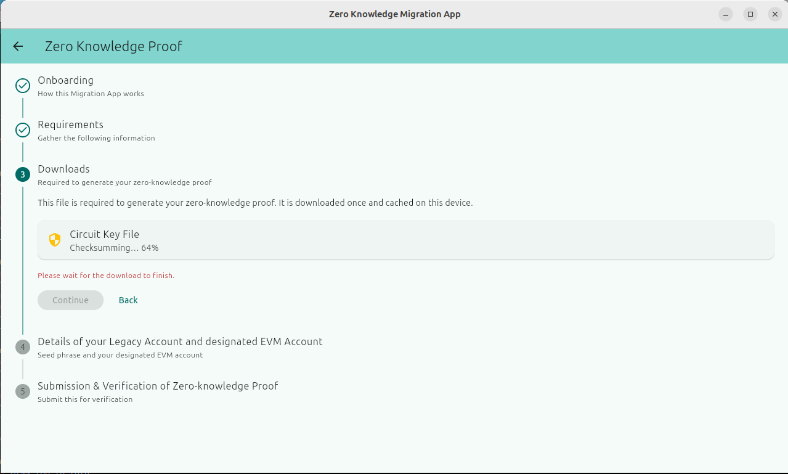
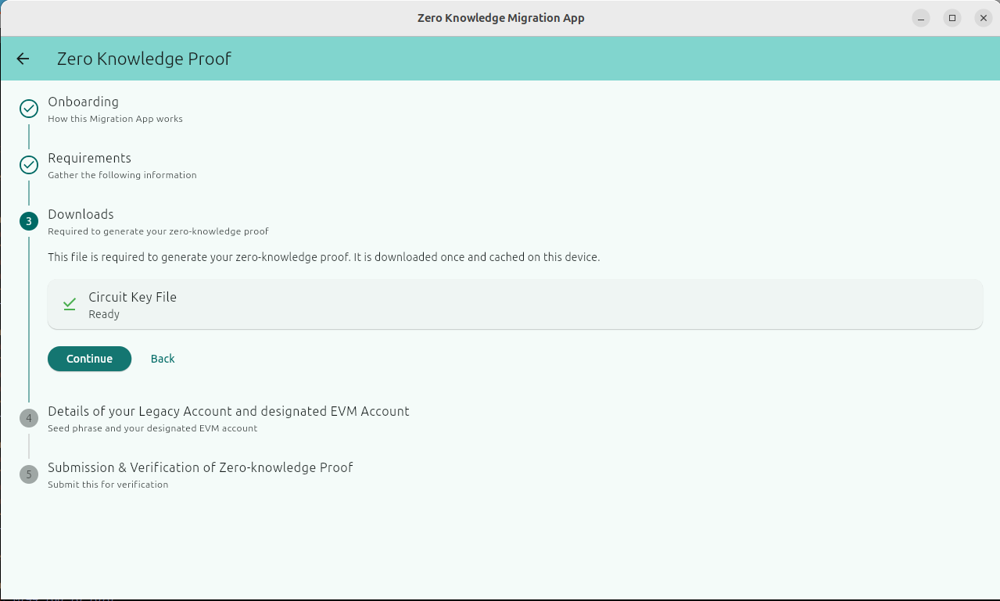
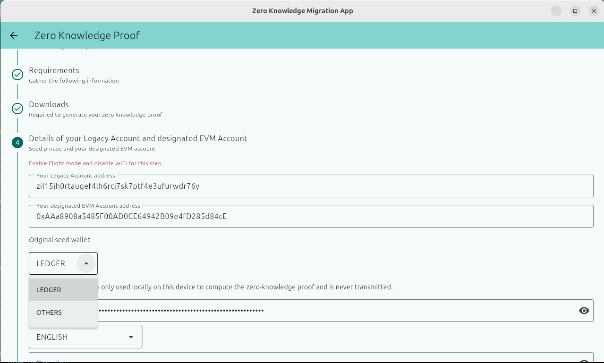
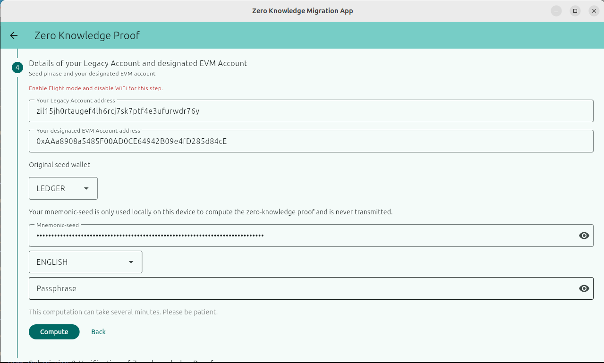
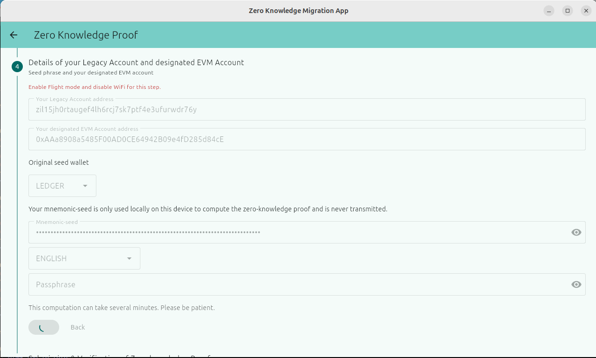
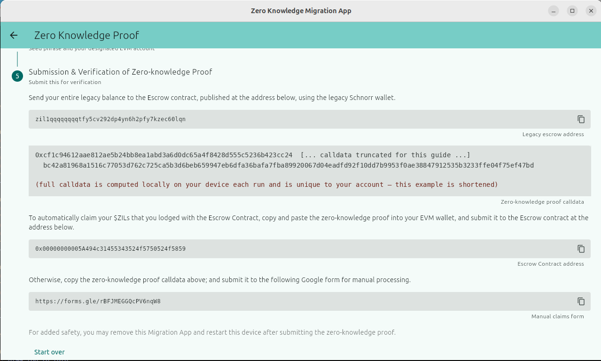

# Demo Walkthrough — Using the Migration App

This page walks through the Migration App screen by screen, using real screenshots from a live run (v0.5.1), so you know exactly what to expect before you start.

For platform-specific installation steps, see **[Linux.md](./Linux.md)** and **[Windows.md](./Windows.md)**. More docs are in this same [`docs/`](./) folder.

---

## 1. Download the app

Get the latest release from:

**https://github.com/Zilliqa/zkp_recovery_app/releases/tag/v0.5.1**

There's a single download for both Linux and Windows users — `zkp-migration-app-linux-amd64.tar.gz`. There is no separate Windows build; see the note below.

### Linux

Download, extract, and run it directly. Full steps: **[Linux.md](./Linux.md)**.

### Windows

Windows doesn't get its own build — you run the exact same Linux app through **WSL (Windows Subsystem for Linux)**. In short:

1. Install WSL2 and Ubuntu (one-time setup).
2. Once you're inside Ubuntu, **follow the exact same steps as the Linux instructions above** — download, extract, run.

Full step-by-step (including the WSL/Ubuntu install itself): **[Windows.md](./Windows.md)**.

---

## 2. Run the app

Once it's downloaded and extracted (and, on Windows, once you're inside your Ubuntu/WSL shell), make it executable and run it:

```bash
chmod +x zkp_migration_app
./zkp_migration_app
```

The app window should appear on your desktop. Continue with the walkthrough below.

---

## 3. Walkthrough

### Step 1 — Welcome and Legacy Account Migration Notice



When you open the app, you'll see the **Legacy Account Migration Notice**. Read it — it explains what this app does in plain terms: your ZIL sitting in a non-EVM ("Legacy") Schnorr-based account needs to be moved to an EVM account you control, because the old non-EVM side of Zilliqa is retired. The notice explains the mechanism (lodge your balance with the Escrow Contract, then claim it to your new EVM account using a zero-knowledge proof) before you do anything. Click **Continue** once you've read it.

### Step 2 — Downloading the circuit key file



The app needs a **Circuit Key File** to generate your zero-knowledge proof. This downloads once and is cached on your device — you won't need to download it again on future runs. Wait for it to finish; you'll see a checksum-verification progress bar.



Once it shows **Ready** with a green checkmark, click **Continue**.

### Step 3 — Enter your account details



This is the important step. You'll enter:

- **Your Legacy Account address** — your old `zil1...` address.
- **Your designated EVM Account address** — the `0x...` address you want your ZIL moved to. Double-check this carefully; this is where your funds will end up.
- **Original seed wallet** — choose **LEDGER** if your legacy wallet was a Ledger hardware wallet, or **OTHERS** for a standard software wallet (the classic Zilliqa wallet, most other wallets). This determines which derivation path the app uses to recover your account from your seed phrase — picking the wrong one means the app won't find your account.

> ⚠️ The app itself displays a warning at this step: **"Enable Flight mode and disable WiFi for this step."** You're about to enter your mnemonic seed phrase — the app wants you offline while it's in memory.



Fill in your **Mnemonic-seed**, select the correct **Language**, then click **Compute**. The **Passphrase** field is optional — only fill it in if you originally set one on your wallet; leave it blank otherwise.

### Step 4 — Computing the proof



The app now computes your zero-knowledge proof locally, on your device. Your seed phrase never leaves your machine — the app only ever generates the resulting proof, not your seed. The notice itself says this can take **several minutes** — be patient and don't close the app.

### Step 5 — Submission & Verification



Once computed, you get everything you need to actually complete the migration:

1. **Send your wallet's ZIL balance** to the Escrow Contract's legacy (`zil1...`) address shown on screen, from your legacy Schnorr wallet.
2. Copy the **zero-knowledge proof calldata** shown (a long hex string) — this is what proves your ownership and claims your funds to your designated EVM account.
3. Submit that calldata one of two ways:
   - **Submit it yourself (instant, small gas fee):** if your wallet lets you send a transaction with raw hex data (MetaMask, Rabby, Brave Wallet, and most desktop browser-extension wallets do — look for **Hex Data** under "Advanced details" on the send/confirm screen, sometimes labeled "Data" or "Input Data"), send a 0-value transaction to the **Escrow Contract address** shown (the `0x...` address on screen) with the calldata pasted into that field. This needs a small amount of ZIL in that EVM wallet to cover gas (typically well under 2 ZIL). Your funds are released as soon as your transaction confirms.
   - **Let us submit it for you (free, no ZIL needed):** don't have any ZIL to cover gas, or just don't want to deal with it? Copy the calldata and submit it via the **Google Form link** shown on screen instead — it's free, and completely safe: the calldata only contains your zero-knowledge proof, it never includes your private key, seed phrase, or any other sensitive information. We'll process it for you within 24 hours.
4. For added safety, the app suggests you may remove the Migration App and restart your device after submitting your proof.

---

## What happens next

Once your calldata is submitted (either path above) and your legacy balance has actually reached the Escrow Contract, your ZIL is released to your designated EVM account automatically — usually within 24 hours if you used the Google Form, immediately if you submitted the transaction yourself directly to the Escrow Contract.

## More information

- [Linux.md](./Linux.md) — Linux install/run instructions
- [Windows.md](./Windows.md) — Windows (WSL) install/run instructions
- Full docs folder: https://github.com/Zilliqa/zkp_recovery_app/tree/master/docs
