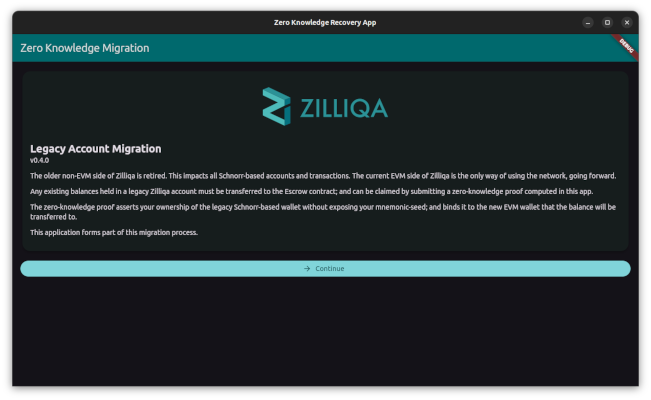

# ZKP Migration on Linux (AMD64).



This guide provides a step-by-step instruction for downloading, verifying and running the ZKP recovery app. It has been built and tested on Ubuntu 24.04.

## Step 1: Download and Verify the Archive

Visit the official Github [releases](https://github.com/Zilliqa/zkp_recovery_app/releases) page to get the download link for the latest version of the Linux desktop app.
**DO NOT DOWNLOAD** the application from any other source.

1. Use Wget from the Ubuntu terminal to download the ZKP archive:
   ```bash
   $ wget <copy and paste the full download link>
   ```
2. Compute the ZKP archive checksum after it has been downloaded.
   ```bash
   $ sha256sum zkp-migration-app-linux-amd64.tar.gz
   ```
3. Compare the checksum value against the one listed on the official release page.

## Step 2: Unzip and Run the Application

**DO NOT PROCEED** if the checksum value computed above does not match the official checksum, as it indicates that the application may have been tampered with.

1. Unzip the ZKP archive only if the checksum matches.
   ```bash
   $ tar -zxf zkp-migration-app-linux-amd64.tar.gz
   ```
2. Run the ZKP migration app.
   ```bash
   $ ./zkp_migration_app
   ```
3. You should see the GUI application start up.


## (Alternative): Build from Source

1. Download the source from [Github](https://github.com/Zilliqa/zkp_recovery_app)
   ```bash
   $ git clone https://github.com/Zilliqa/zkp_recovery_app.git
   ```

2. Install and build [Mopro](../README.md).
3. Install [Flutter](https://docs.flutter.dev/platform-integration/linux/setup).

4. Build the Linux application
   ```bash
   $ cd flutter
   $ flutter build linux
   ```

5. Run it
   ```bash
   $ build/linux/x64/debug/bundle/zkp_migration_app
   ```
