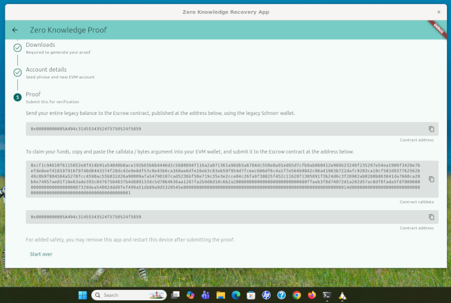

# Installing Ubuntu 24.04 with WSL2 and GUI Support



This guide provides step-by-step instructions for installing Ubuntu 24.04 using Windows Subsystem for Linux 2 (WSL2) and setting up a graphical user interface (GUI) application (`gnome-text-editor`) to ensure WSLg (Windows Subsystem for Linux GUI) is working correctly.

## ⚠️ Requirements and Prerequisites

Before proceeding, ensure your system meets the minimum requirements for WSL2 and GUI support. 

* **Operating System**: Windows 10, version 2004 and higher (Build 19041 and higher) or Windows 11.
* **Hardware**: A 64-bit processor with Second Level Address Translation (SLAT).
* **System Settings**: Virtualization must be enabled in your computer's BIOS/UEFI.
* **Graphics Driver**: A vGPU driver installed for Windows (Intel, AMD, or NVIDIA) is highly recommended for hardware-accelerated OpenGL rendering.

**🛑 IMPORTANT: WSL2 ONLY**
This application and GUI setup strictly require **WSL2** along with the WSLg feature. **It will NOT work with WSL1.** WSL1 does not include the necessary architectural support for the Wayland server and RDP integration provided by WSLg.

*For more context, review the [official Microsoft documentation on WSL prerequisites](https://learn.microsoft.com/en-us/windows/wsl/install).*

---

## Step 1: Install or Update WSL2

Windows 11 and modern builds of Windows 10 have simplified the WSL installation process.

1. Open **PowerShell** or **Windows Command Prompt** as an Administrator.
2. Ensure you are defaulting to WSL2 by running:
   ```bash
   wsl --set-default-version 2
   ```
3. Update WSL to ensure you have the latest features, including the WSLg component required for GUI apps:
   ```bash
   wsl --update
   ```
   *(If prompted, restart your computer.)*

## Step 2: Install Ubuntu 24.04

You can install Ubuntu 24.04 directly from the command line.

1. In your Administrator PowerShell or Command Prompt, run:
   ```bash
   wsl --install -d Ubuntu-24.04
   ```
2. Wait for the download and installation to complete. A new Ubuntu terminal window will open automatically.
3. Follow the on-screen prompts in the Ubuntu terminal to create your UNIX **username** and **password**.

*Reference: [Microsoft Docs - Install WSL](https://learn.microsoft.com/en-us/windows/wsl/install)*

## Step 3: Update Ubuntu Packages

It is best practice to ensure all packages inside your new Ubuntu environment are up to date.

1. Inside the Ubuntu terminal, run the following commands:
   ```bash
   $ sudo apt update
   $ sudo apt upgrade -y
   ```
2. Enter your UNIX password when prompted.

## Step 4: Install `gnome-text-editor`

To test the GUI capabilities of your WSL2 environment, we will install `gnome-text-editor`, a standard graphical text editor for the GNOME desktop environment.

1. In the Ubuntu terminal, run:
   ```bash
   $ sudo apt install gnome-text-editor -y
   ```

## Step 5: Test the GUI

WSL2 (via WSLg) seamlessly integrates Linux GUI applications into the Windows desktop environment. You do not need to start an X-server or configure `DISPLAY` variables manually on modern WSL2 installations.

1. Launch the application from the Ubuntu terminal by typing:
   ```bash
   $ gnome-text-editor
   ```
2. **Success!** A graphical window for GNOME Text Editor should open directly on your Windows desktop, complete with a taskbar icon and window decorations.

*For additional troubleshooting and advanced GUI configuration, refer to the [Microsoft Docs - Run Linux GUI apps on the Windows Subsystem for Linux](https://learn.microsoft.com/en-us/windows/wsl/tutorials/gui-apps).*

## Step 6: Download and Run the Linux app.

Follow the [Linux](./Linux.md) instructions to download, verify and run the ZKP application.